모바일 3주차 이모티콘 저장소

### Setting Done

- branch -> fork -> clone
- .gitignore
- create EmoticonApp project

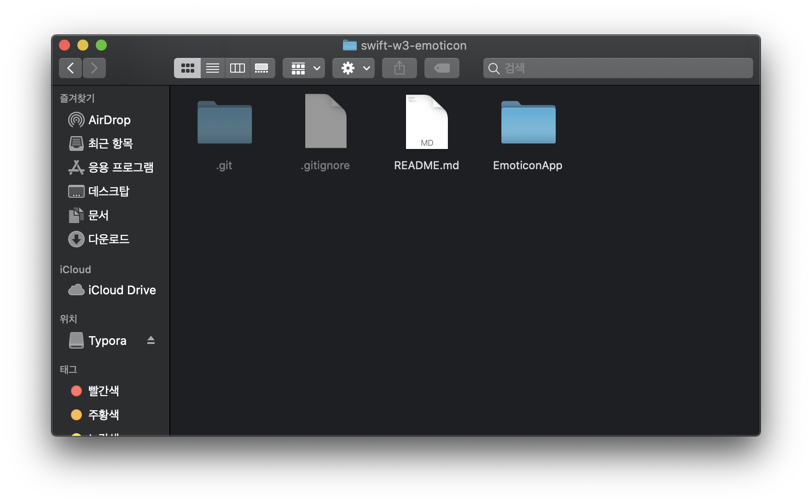

### Add some assets

- add two images : pattern, basket

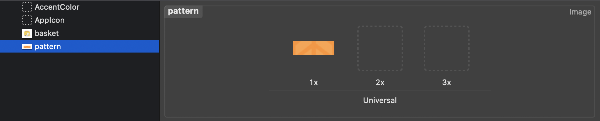

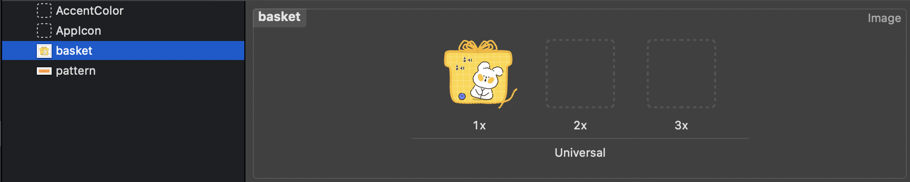

### add TableView in the View

- add TableView
- declare list of title/author/image
- override methods : tableView()

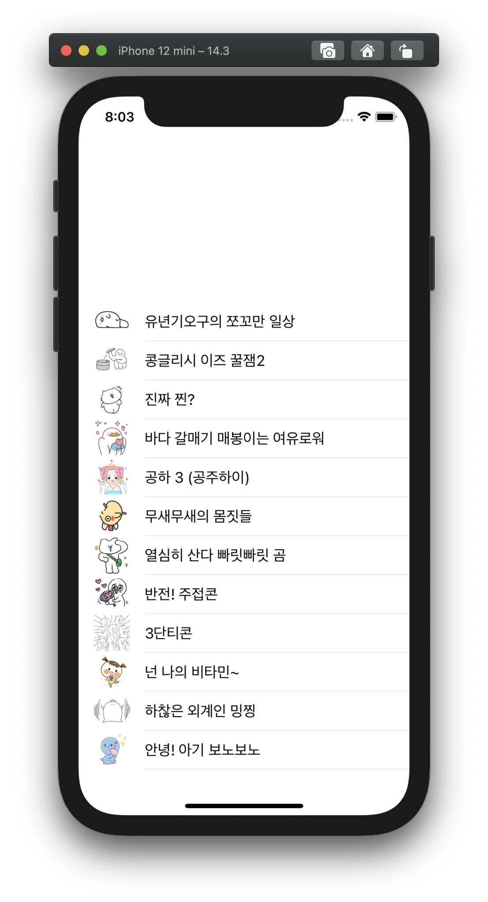

### convert some view into code

- add upperview in code
- add some constraints in code

### Fill upperView

- fill background with pattern image
- add jeje Image

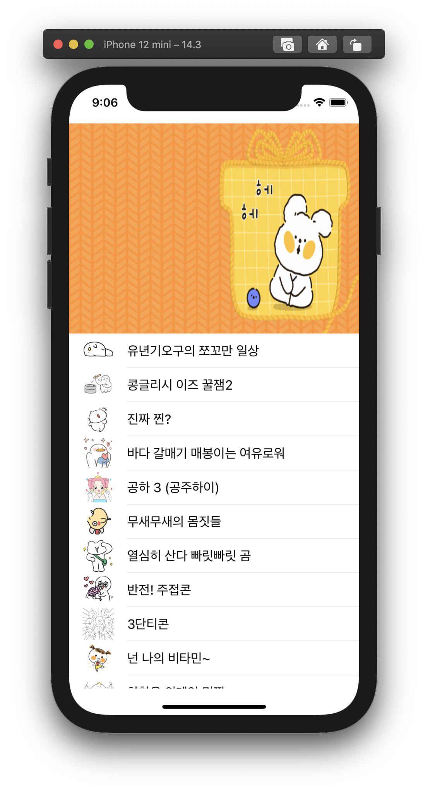

### Fill UpperView(2)

- add Label : titleInView
- add Label : descriptionInView

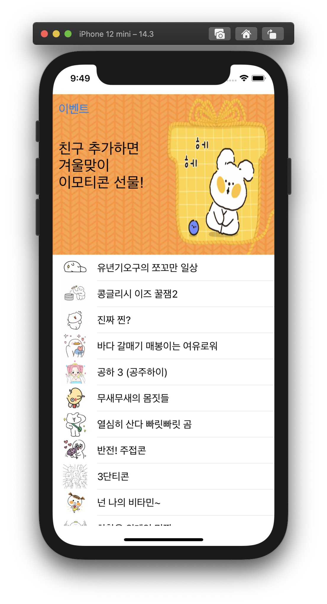

### Add UpperInnerView

- add UpperInnerView as a subview of upperView
- give upperInnerView padding

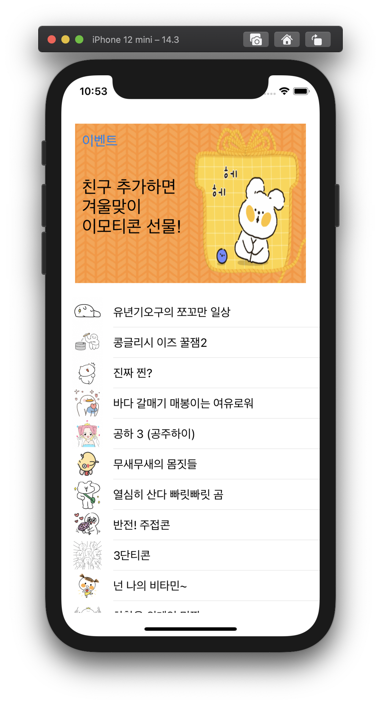

### Midify - descriptionInView

- remove heightAnchor, widthAnchor
- add method : sizeToFit()

### Make model group

- make model group
- make a file : Emoticon.swift
- make a Model : struct Emoticon
  - list data
  - 3 methods : title, author, image

### Modify - TableViewController

- erase codes using raw data list
- add object : Emoticon()
- instead of access index of list directly, using struct method

### create myCell.swfit

- create myCell class
- set the class as a custom class of cell

### add some Subviews

- titleLabel
- descriptionLabel
- leadingImage
- extension UILabel to add method setConstraint

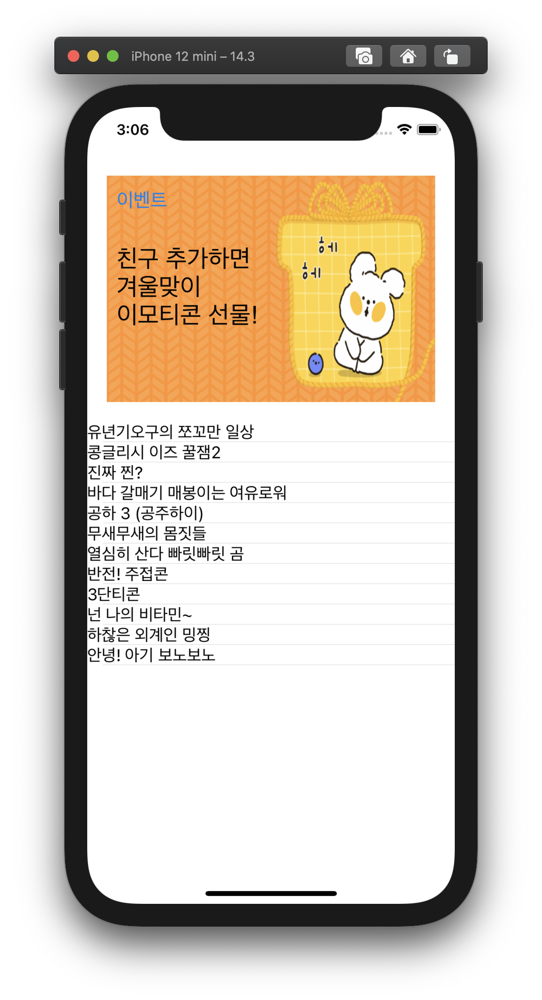

### setting cell height

- setting cell height using `tableView(_ tableView: UITableView, heightForRowAt indexPath: IndexPath)` method

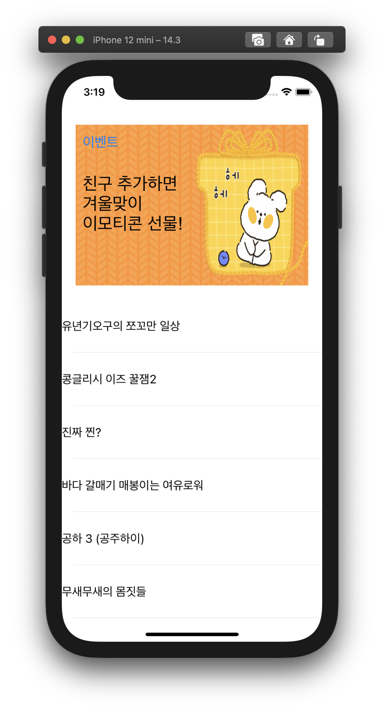

### configure all elements in custom cell

- title label
- author label
- ImageView
- purchaceLabel
- set constrainits

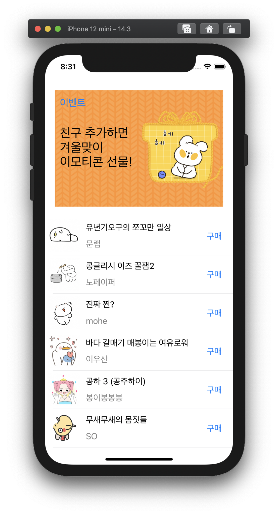

### Modify : how to measure height

- using initial height instead of height at that moment

### Got some feedback --> Modify!

- change struct name : Emoticon -> Emoticons
  - add two methods to create unique data : getEmoticons(), registerEmoticons
- make another struct : Emoticon
  - implement getter and setter

### Feedback Modify2

- change method : Emoticons.getEmoticons() -> getEmoticon(index : Int)
  - apply this modification -> TableViewController can pass minimum data to configure a cell
- add variable : emoticons.count

### Feedback Modify - TableViewController tableView methods

- add Emoticions.registerEmoticons() method in viewDidLoad()
- return Emoticons.count in tebleview method
- call cell.setEmoticon method instead of calling 3 methods

### Feedback Modify - myCell Methods

- combine 3 methods that configure each subview into 1method : setEmoticon()

### Feedback Modify - remove unused overriding method in myCell.swift

### Feedback Modify - Naming Convention

### Feedback Modify -  Decompose ViewController into View and Controller

- make UpperBelowView.swift
- make class : UpperView
  - add set methods : setUpperView, setUpperInnerView, setUpperImage, setUpperImageView, setUpperImageView, setTitleInView, setDescriptionInView
  - add get methods : getUpperInnerView, getTitleInView
- extension class : UIVlew
  - add method : setBelowView

### Feedback Modify - Decompose TableViewController into View and Controller

- make TableViewExtension.swift
- extension class : UITableView
  - add set methods : setTableView, assignDelegateAndDataSource

### Add NavigationController

- Embed NavigationController
- extension UINavigationItem -> add method : setNavigationItem

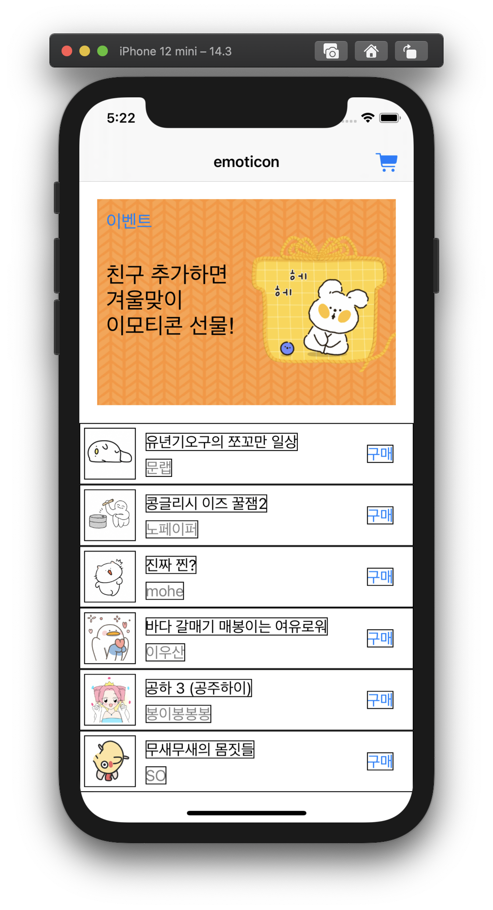

### Rename : TableViewController -> EmoticonListTableViewController

### Add action to cart button

- add action : push new ViewController(HistoryTableViewController)
- remove : NavitationItemExtension

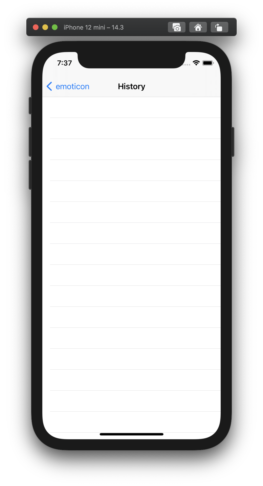

### Remove useless borders

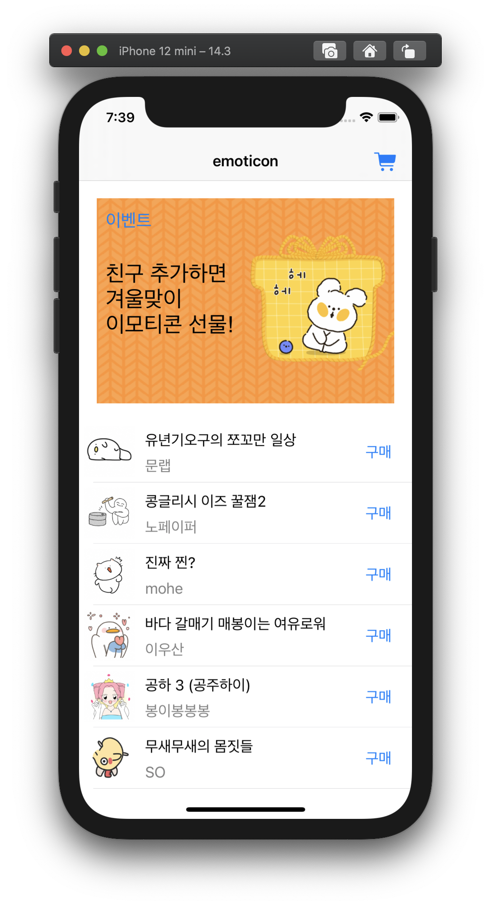

### make Clear Button

- make clear button with action : clearButtonTouched
- add the button as a right bar button

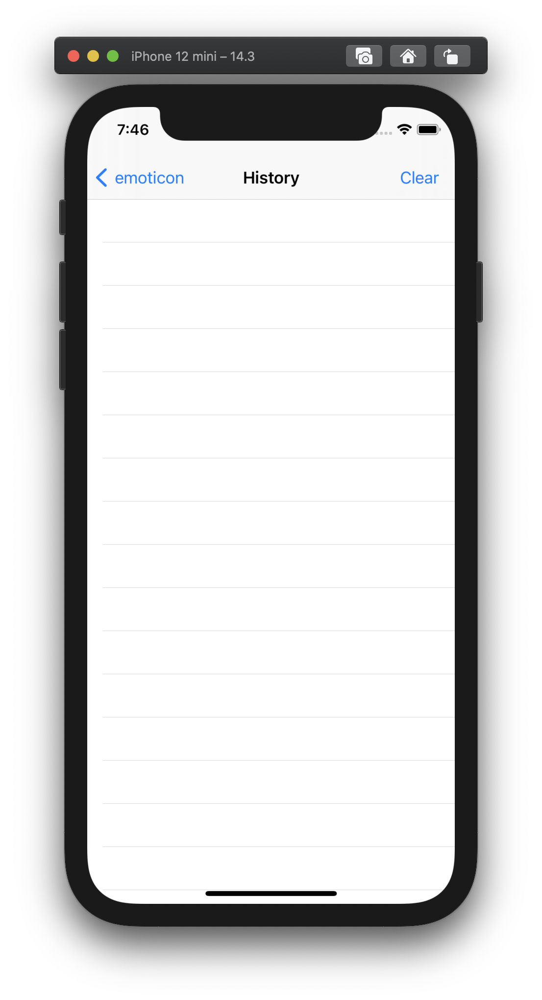

### NotificationCenter

- addObserver : EmoticonListTableViewController
- new method : addHistory
- addPost : buyButtonTouched

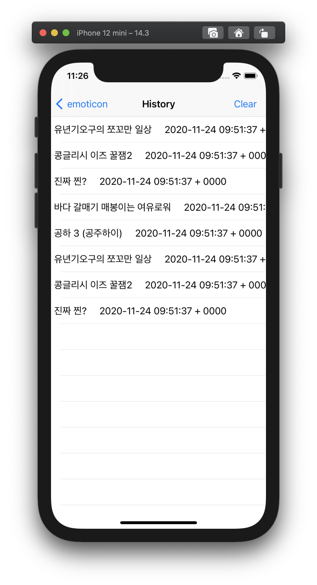

### ClearButton

- add action : clearButtonTouched

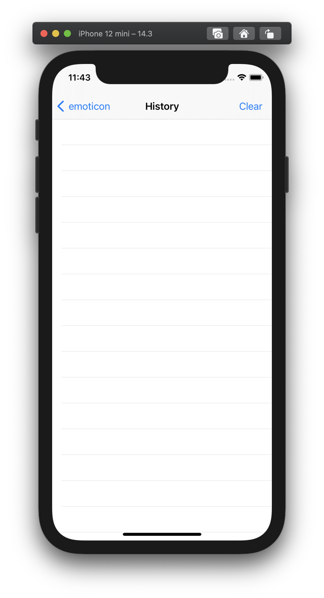

### ClearButtonTouched - add logic

- add logic : reloadData()

### Record Exact Log

- using Date().description, record exact time when buy button touched

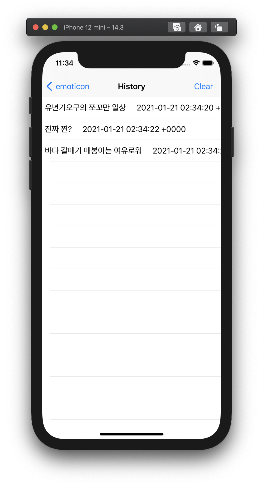

### Remove from History

- make swipeRecognizer
- addGestureRecognizer : swipeRecognizer
- use NotificationCenter to notify the history log is swiped
- add HistoryTableViewController as a observer of swiping
- add Method of Histories : deleteHistory()

